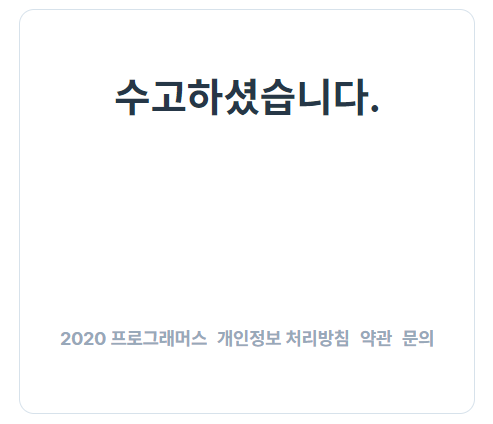
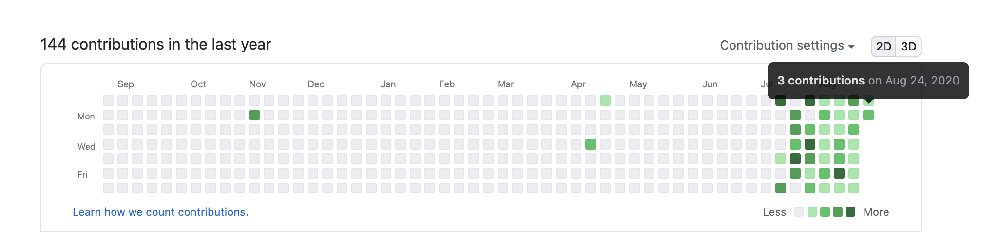

## 1. 데브 매칭

오랜만에 프로그래머스 Dev-Matching 프로그램에 도전했다.

프론트엔드 개발자로 지원하기 위한 좋은 방법이라고 생각해서, 이력서를 꾸준히 업데이트 해 뒀고 몇 주전에 일찌감치 접수해서 오늘! 조금 전에 드디어 과제를 마쳤다.

알고리즘을 구현하는 코딩 테스트는 항상 손도 못 대고 좌절만 하다가 끝나는(~~제출도 못 해본~~) 경우가 대부분이었다. 하지만 오늘처럼 과제 테스트를 하면 어렵기는 마찬가지지만, 그래도 오늘 과제에서는 어느 정도 요구하는 필수 기능을 구현하는 데~~까지만~~ 성공했다.

라이브러리, 프레임워크 없이 오로지 순수(바닐라) 자바스크립트(ES6)로만 코딩하는 과제였는데, 한동안 리액트 공부만 하다 보니 오히려 바닐라 자바스크립트의 기본이 많이 부족하다는 것을 깨달은 시간이었다.

요구사항 중 한 가지가 컴포넌트 단위로 작게 나눠서 느슨하게 구현하라는 거였는데, 난 바닐라 자바스크립트로는 리액트처럼 파일 단위의 컴포넌트를 만들어 본 경험이 없었다. 게다가 리액트가 아닌 ES6의 class, import, export를 이해하지 못한 상황에서 구현하려다가 시간을 많이 소비하기도 했다.

이번 과제를 통해 어떤 것을 더 공부해야 할지, 기업에서 어떤 구현 방식을 요구하는지, 그것으로 어떤 개발자를 원하는지 간접적으로 알 수 있었고 많은 생각을 하게 된다.

이번에도 역시 면접까지 이어지는 건 아무래도 가능성이 낮지 않을까 싶지만, 과제를 하며 직접 많은 것을 느꼈기 때문에 더 노력해야겠다고 결심하게 된 계기가 된 점은 만족스럽다.

## 2. 일일 커밋

### 프론트엔드 공부하기

한동안 이런저런 핑계로 방치해뒀던 잔디 심기를 꾸준히 하고 있다.

다시 시작한 건 7월 12일부터, 본격적으로 ~~빵꾸내지 말자~~ 꾸준히 해 보자고 다짐한지는 1개월이 다 돼 간다.

돌이켜보니 이 기간동안 그래도 제법 많은 것을 배웠다.

- React (Router, Hooks...)
- React Native
- Styled-Components
- fetch API, Axios
- gh-pages, Netlify, Expo
- ES6+
- CSS Flex, Grid
- CSS 애니메이션으로 인터랙티브한 웹 만들기
- React-Redux 등

한 달의 과정을 되돌아보니, 본격적인 프론트엔드 실력을 만들기 위한 기초 공사를 시작한 기간이 되었다고 생각한다.

[노마드코더](https://nomadcoders.co/)의 니콜라스 선생님, 감사합니다.

### 체력 만들기

시작한지 2주 정도까지는 퇴근하고 내가 하고 싶은 공부를 할 수 있다는 사실만으로도 굉장히 즐거웠다.

하지만 역시 나태함은 금방 고쳐지지 않았다.

어느 순간부터 회사 프로젝트 설계 과정에 지쳤는지, 마치고 지친 몸과 마음을 이끌고 카페로 다시 '출근'한다는 생각이 들었다. 그런 날은 한 시간 정도 집에서 쉬다가 다시 나와 악착같이 카페로 향했다.

체력이 많이 약해진 것 같아서 2주 전부터는 일일 푸쉬업도 하고 있다. 집에서 할 수 있는 아주 좋은 운동이라고 생각해서 열심히 하고 있다.

### 코딩 테스트 준비도 해야 하는데

생각만 하고 실천을 못 하고 있다. 나에게는 알고리즘이라는 산이 너무 큰 부담으로 자리잡고 있는 것 같다.

서둘러서 프론트엔드 지식을 쌓고, 알고리즘 공부도 조만간 본격적으로 시작해야 할 것 같다.
