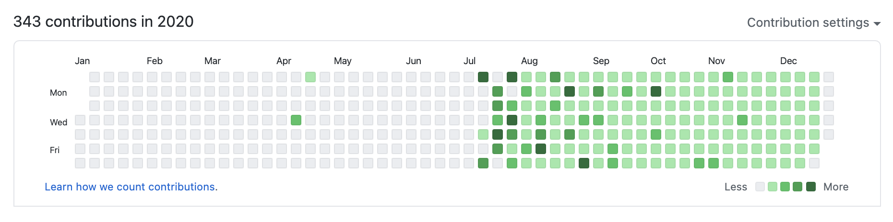

## 2020년 상반기

### 4월

끔찍했던 프로젝트가 드디어 종료되었다.

### 5월

그토록 원하던 사무실 내근을 시작했다. 개발 일정 쥐어짜내기는 본사 사무실에서도 여전하다. 6월 말까지 코로나를 핑계로 어떻게든 빨리 빨리 만들어내라고 닦달이다.

### 7월

갑자기 또 파견을 가야 한단다. 어떤 프로젝트인지 내용은 대충 듣고 바쁘게 투입되었다.

## 2020년 하반기

7월에 시작해서 12월 말에 끝나기로 예정되었던 프로젝트가 아직도 개발이 끝나지 않았다. 하지만 계약된 일정에 따라 12월 31일을 기점으로 나의 업무는 공식적으로는 종료되었고, 회사의 요청에 따라 일주일 추가 근무만 더 하면 투입이 완전 종료될 예정이다.

마지막까지도 나를 괴롭히고 있는 이 프로젝트 때문에 2020년은 정말 힘들었다. 오죽했으면 그 전까지 이직 준비를 손놓고 있었다가 투입된 지 2주 뒤부터 홀린 듯이 이직을 위한 공부와 운동을 시작했을까.

### 탈출을 위한 준비 시작

'여기서는 개발자로서 미래가 없다. 최대한 빨리 이런 환경에서 탈출해야 한다...'는 두려움을 안고 퇴근 후에는 어김없이 최소 하루 한 개의 강의를 보며 커밋을 하고, 옆에 엎드려서 푸시업을 100개씩 했다.

비록 잔디의 개수가 많지는 않아도 꾸준하게 실천한 것에 의미를 두고 싶은 한편, 2020년 마지막 주에 완전히 녹초가 돼서 꾸준함을 끝까지 끌고 가지 못한 점이 아쉽다.

### 최악의 프로젝트, 자괴감

프로젝트에 관해 이야기하자면 할 말이 정말 많지만, 인생에서 다시는 이런 프로젝트를 하고 싶지 않다.

내가 속한 이 회사는 자신들이 개발자에게 어떤 규모의 프로젝트를 맡기는지 제대로 파악하지 않았고, PM은 마찬가지로 고객이 어떤 제품을 원하는지 제대로 측정하지 않았다. 가장 문제인 것은 고객 측에서 설계 전체를 비틀어버리는 추가, 변경 사항을 요구한 게 한두 번이 아니었다. 그 요구는 연말 마지막 날까지도 계속되었다.

PM은 맨먼스(M/M, Man Month)라는 단위로 개발 프로젝트를 산정할 뿐, 개발 방법을 논의하려고 하면 "그래서 돼요? 안 돼요?" 라며 개발에는 전혀 관심이 없었다. 본인이 맡은 업무는 행정적인 것을 처리해서 도장만 찍으면 끝일 뿐인 사람이었다. 골 때리는 건 개발이 아직도 끝나지 않았는데 프로젝트는 행정적으로는 완료 처리가 되었다는 사실.

회사 역시 그 일이 마무리되고 있는지 아닌지가 중요할 뿐 직원을 소모품으로 생각하는 게 너무 눈에 보였고, 추가 수당 따위는 없었다. 7월부터 12월까지 근무 시간을 기록해두었다. 7월은 186시간 57분, 8월은 172시간, 9월은 187시간 18분, 10월은 166시간 24분, 11월은 222시간 26분, 12월은 241시간 41분을 근무했다.

마지막 두 달은 정말 무지막지한 야근의 연속이었다. 개발 기간을 맞추기 위해 다른 프로젝트에 파견되어있는 동료 개발자들이 와서 1~2주 정도 도와주는 식으로 일을 했는데, 처음부터 개발했던 나조차도 이해하며 개발하기 어려운 업무 프로세스를 잠깐씩 와서 어떻게 돕는단 말인지. 자괴감의 연속이었다.

12월 마지막 주에는 정말 아무것도 하기 싫었다. 하루도 거르지 않은 잔디 심기를 중단했고, 공부도 손에 안 잡혔다. 운동은 그나마 쉬지 않았다. 완전한 번아웃을 느꼈다. 버그가 두려워서 심장이 빨리 뛰고 숨을 제대로 쉴 수 없었을 지경에까지 이르렀던 어느 이름 모를 개발자의 사연이 나도 공감되기 시작하면서 몸과 마음이 피폐해져감을 느끼고 있다.

내일부터 일주일만 더 출근하면 정말 투입이 종료된다. 그러면 이 번아웃 상태에서 회복될 수 있을까?

이 자괴감이 굉장히 오래 지속되고 있다는 것을 8월에 끄적여두었던 글로 대신한다.

> 그래요. 이해합니다.
> SI 프로젝트만 십수 년 하시다보면 최신 트렌드 모를 수 있어요.
> WSL, Docker, 리액트, VS Code도 모를 수 있어요.
> Vue.js 물론 쓰면 되지만, 리액트만 쭉 배우다보니 새로 배워서 적용할 시간이 부족합니다.
> jQuery? 물론 쓰면 됩니다. 그렇지만, 저는 힘듭니다.
> 최신 개발 트렌드를 알고 있는 저로서는 배운 걸 써먹지 못해 힘듭니다.
> 최대한 주어진 환경에 맞춰 개발 환경을 셋업해서 쓰고 있습니다.
> Eclipse랑 VS Code 두 개 띄워놓고 코딩하면 됩니다.
> Spring Boot가 아니라 Spring MVC(JSP)에 리액트 적용하는 것도 불가능한 건 아니더군요.
> 그러나 때로는 그조차도 불가능해 화가 납니다.
> Java 11을 흔히 쓰는 요즘, 툴에 따라 가끔은 Java 8버전으로 설정조차 어렵게 되어있습니다.
> Gradle을 쓰는 건 상상도 못 하지만, 신규 프로젝트에서 Maven도 아니고 Ant builder로 환경 잡는 것에 사실 좀 많이 놀랐습니다.
> 정 안 되면 리액트? 그까이꺼 안 쓰면 됩니다. UI? 좀 포기하면 됩니다.
> 요즘 업무적으로는 많이 내려놓고 있습니다. 대신, 최신 기술을 열심히 배우고 있습니다.
> 퇴근 후 진짜 제 공부를 하고 있습니다.
> 감사합니다.

### 올해는 탈출할 수 있을까?

어느 정도 마음을 추스린 뒤에 다시 개발 공부와 알고리즘 공부를 재개하려고 한다. 맑은 정신은 강한 신체에서 나온다고 믿기 때문에 앞으로도 규칙적인 운동은 항상 병행할 계획이다.

계속해서 '탈출'이라는 말을 쓰게 되는데, 정말이지 너무나도 간절한 일이다. 올해는 꼭 제대로 이직 준비를 해서 탈출을 이루고 싶다.
